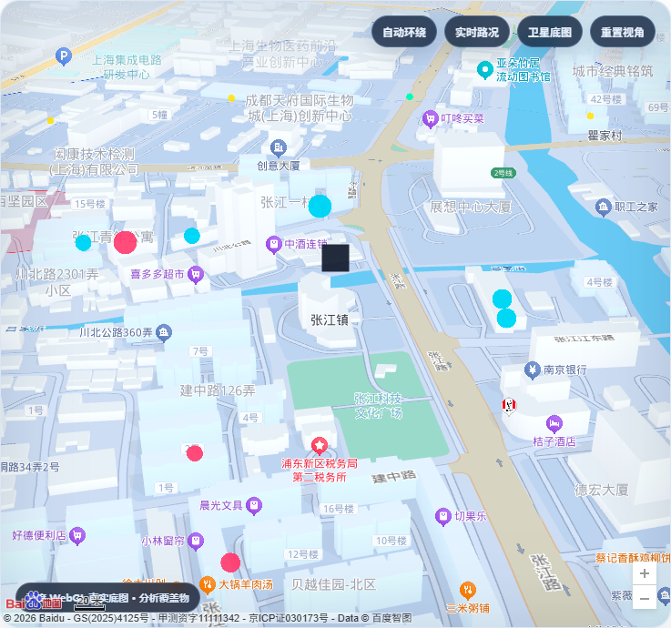

# 圈析智图｜上海真实社区对比测试报告

- 实测时间：2026-09-14
- 数据来源：百度地图 Web 服务 API
- 数据标识：`LIVE_BAIDU_MAP_API`
- 统一参数：15 分钟、16 个方向、每方向 4 个半径、POI 检索半径 1800 米
- 原始证据：`真实对比测试报告.json`、`真实对比测试报告.csv`

## 对比总表

| 指标 | 张江镇街道级样例 | 徐家汇街道级样例 |
|---|---:|---:|
| 输入地址 | 上海市浦东新区张江镇人民政府 | 上海市徐汇区徐家汇街道办事处 |
| 百度 BD09 中心 | 121.620868, 31.211058 | 121.494025, 31.212477 |
| 综合体检分 | 42.7 | 100.0 |
| 数据置信度 | 100.0% | 100.0% |
| 等时圈面积 | 1.608 km² | 2.088 km² |
| 等时圈 / 直线圆面积比 | 0.439 | 0.570 |
| 路径绕行系数中位数 | 1.390 | 1.277 |
| 盲区采样点 | 4 | 0 |
| 获取并去重后的 POI | 55 | 190 |
| HTTP 请求 | 10 | 15 |
| 缓存命中 | 1 | 0 |
| 配额单元估算 | 72 | 77 |
| 含地理编码的总耗时 | 2901 ms | 3301 ms |

> HTTP 请求数与配额单元不是同一概念；RouteMatrix 的配额估算按最终路线条数统计。实测后已将 `BAIDU_CONCURRENCY` 从 3 下调为 1，避免免费账户贴近地点检索并发上限。

## 设施覆盖

| 类别 | 张江：圈内 / 检索 | 徐家汇：圈内 / 检索 | 目标 |
|---|---:|---:|---:|
| 基础医疗 | 1 / 7 | 27 / 60 | 2 |
| 小学 | 0 / 2 | 4 / 10 | 1 |
| 菜市场 | 1 / 2 | 2 / 9 | 2 |
| 药店 | 4 / 12 | 21 / 34 | 3 |
| 购物 / 超市 | 10 / 30 | 24 / 58 | 3 |
| 养老服务 | 0 / 2 | 3 / 19 | 1 |

## 结果解读

同一参数下，徐家汇样例的等时圈面积、圈内设施数量和综合体检分均高于张江样例。张江样例识别到 4 个服务盲区采样点，且基础医疗、小学、菜市场和养老服务未达到项目内部目标；徐家汇样例六类设施均达到目标，当前离散规则下未发现盲区采样点。

这些结果提示两个样例在可达设施密度和步行路网表现上存在明显差异，但不能仅凭本次 API 快照断言具体因果。差异可能与道路连通、社区边界、设施分布和地图检索召回有关，仍需结合现场调查、人口与设施容量等资料验证。

张江样例有 1 个径向样本出现局部耗时逆序，系统已使用保守单调包络参与插值并在结果中记录；没有隐去或手工美化该异常。

## 真实城市 3D 浏览器验收

浏览器端使用独立 AK 加载百度 JSAPI GL WebGL 底图，叠加张江真实分析记录。实测状态：地图可加载，缩放 18.5，倾斜约 66.7°，旋转约 44.9°，共 72 个覆盖物，控制台 0 个严重错误。建筑和道路来自百度底图；彩色 POI、等时圈、距离环和盲区属于本项目分析覆盖物。

## 真实性与适用边界

1. 等时圈是百度 RouteMatrix 离散测时加径向插值的近似结果，不是底层道路图全量 Dijkstra 洪泛。
2. “体检分”是项目内部可解释指标，不是政府或赛事官方评分。
3. POI 数量不代表设施容量、服务质量、实时营业状态或人口需求。
4. 盲区为离散采样筛查结果，不能替代法定规划、现场踏勘与行政审批。
5. 完整原始 JSON 和 CSV 随报告保留，便于复核而不是只提供截图。
